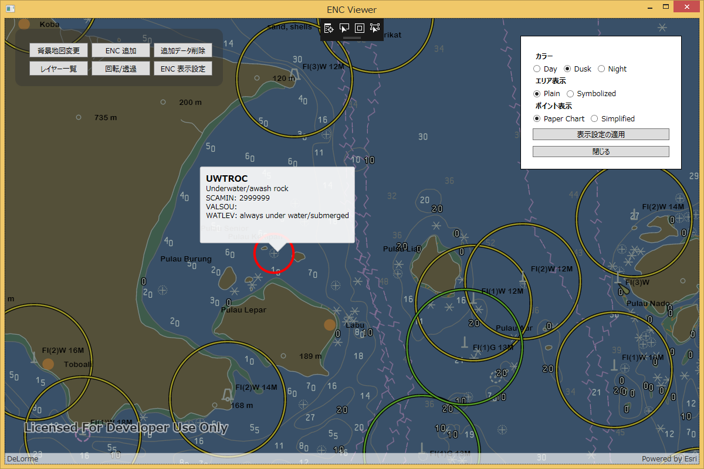

# enc-viewer-dotnet

ENC (Electronic Navigational Charts: 航海用電子海図) を表示するビューアーです。
S-57 形式の ENC のセルをサポートしています。

## 機能

* セルの表示、表示スタイルの設定
* 要素の選択、属性表示
* セルの表示/非表示、透過設定
* 地図の回転
* 背景地図の変更
* フリーハンドでの作図
* マップの画像出力

## 使用している製品

* [ArcGIS Runtime SDK for .NET (WPF API)](https://developers.arcgis.com/net/)

ArcGIS の開発キットを使用して開発を行う場合は ArcGIS for Developers 開発者アカウント（[ArcGIS for Developers](https://developers.arcgis.com/)）が必要です。開発者アカウントは無償で作成することができます。作成方法は[こちら](http://esrijapan.github.io/arcgis-dev-resources/get-dev-account/)を参照してください。

## 動作環境
* Windows 10 / 8.1 / 7

## ライセンス
Copyright 2018 Esri Japan Corporation.

Apache License Version 2.0（「本ライセンス」）に基づいてライセンスされます。あなたがこのファイルを使用するためには、本ライセンスに従わなければなりません。本ライセンスのコピーは下記の場所から入手できます。

> http://www.apache.org/licenses/LICENSE-2.0

適用される法律または書面での同意によって命じられない限り、本ライセンスに基づいて頒布されるソフトウェアは、明示黙示を問わず、いかなる保証も条件もなしに「現状のまま」頒布されます。本ライセンスでの権利と制限を規定した文言については、本ライセンスを参照してください。

ライセンスのコピーは本リポジトリの[ライセンス ファイル](./LICENSE)で利用可能です。
